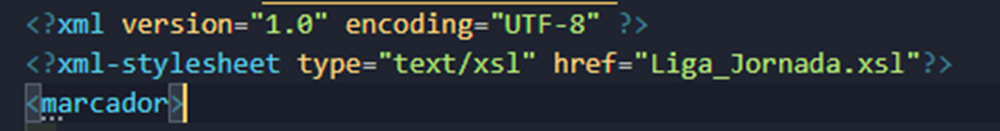

# resultados_futbol

Creación de HTML desde XML con uso de XSLT
Proyecto
En este proyecto se hace uso de tres archivos XML del periódico deportivo de tirada nacional MARCA. En dichos documentos se detallan los principales datos de las jornadas 36ª, 37ª y 38ª de la primera división de la Liga de fútbol de España:
 Resultados de la jornada
 Datos de la clasificación del campeonato
Sirviendo como fuente de dos grupos de datos dentro de un mismo documento, el resultado del proyecto es una página web con dos tablas detalladas, una por cada uno de los grupos de datos. Cada una de las páginas se genera desde su propio archivo XML a través de la misma hoja de estilos XLST.
Detalle de documento XML trabajado:

NOTA: En este proyecto se ha usado el IDE Apache Netbeans en su versión 11.0 por las eficaces herramientas que dispone para la elaboración y transformación de los documentos.

Creación de la hoja de estilos XSLT
Primeramente, se crea un documento XSLT indicando el método de salida a HTML.

Posteriormente se enlazan los XML al archivo XSLT añadiendo la línea:

<?xml-stylesheet type="text/xsl" href="Liga_Jornada.xsl"?>

Dentro del documento se indica en las etiquetas <head> el enlace al icono, la hoja de estilos CSS y el título de la página web resultado con las líneas:

Dentro del <body> se crea un área de título con la etiqueta <ahead> de HTML5 donde se detalla el nombre de la competición extrayendo el valor con la expresión XPATH "//competicion/nombre", seguido de la temporada "//temporada" y la jornada que se muestra en el atributo id de la etiqueta <jornada> y se recoge con "//jornada/@id".
A continuación, se crean dos secciones para cada uno de los principales grupos de datos por sus etiquetas identificativas:
 <eventos> dentro de <section>
 <clasificacion> dentro de <aside>
La etiqueta <eventos> contiene una serie de etiquetas <evento> con los datos de cada uno de los partidos de la jornada los cuales se utilizan para formar la primera tabla. Para ello se seleccionan los datos de las siguientes etiquetas:
<fecha> Cadena de texto con la fecha y hora del evento
<equipolocal> Cadena de texto con el nombre del equipo local
<equipovisitante> Cadena de texto con el nombre del equipo visitante
<resultadolocal> Cadena de texto con el número de goles del equipo local
<resultadovisitante> Cadena de texto con el número de goles del equipo visitante
<escudoLocal> Enlace a una imagen con el escudo del equipo local
<escudoVisitante> Enlace a una imagen con el escudo del equipo

Detalle del contenido de la etiqueta <evento>:

Para recoger los datos de cada una de las ocurrencias se hace uso de la herramienta for-each indicando la etiqueta <evento> como padre del contenido de las etiquetas a mostrar:

Luego de añadir estilo en el documento CSS al documento HTML que obtenemos de la transformación, el resultado en el navegador para cada uno de los eventos es el siguiente:

De este primer grupo de etiquetas también se realiza una lista horizontal en la parte superior de la página con estilo de menú donde se muestran las imágenes de los escudos de los equipos. Para ello se toman como fuente las etiquetas <escudoLocal> y <escudoVisitante>.

Detalle del código de creación de la lista:

Añadiendo estilo en el documento CSS a nuestro documento HTML, el resultado en nuestro navegador para cada la lista es la siguiente:

Para formar la segunda tabla se hace uso del contenido de la etiqueta <clasificacion> que contiene una etiqueta <team> por cada uno de los equipos que participan en el campeonato agrupando sus datos en las etiquetas:
<name> Cadena de texto con el nombre del equipo
<rank> Cadena de texto con la posición en el campeonato de liga
<points> Cadena de texto con los puntos totales en la liga
<played> Cadena de texto con el número de partidos jugados
<won> Cadena de texto con el número de partidos ganados
<lost> Cadena de texto con el número de partidos perdidos
<drawn> Cadena de texto con el número de partidos empatados
<goals_scored> Cadena de texto con el número de goles marcados
<goals_conceded> Cadena de texto con el número de goles recibidos

Detalle del contenido de la etiqueta <team>:

Para recoger los datos de cada una de las ocurrencias se hace uso de la herramienta for-each indicando la etiqueta evento como padre del contenido de las etiquetas a mostrar:

Luego de añadir estilo en el documento CSS al documento HTML que obtenemos de la transformación, el resultado en el navegador para cada uno de los equipos es el siguiente:

Resultado final

